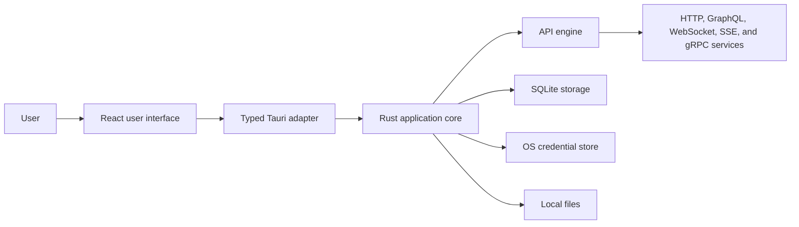
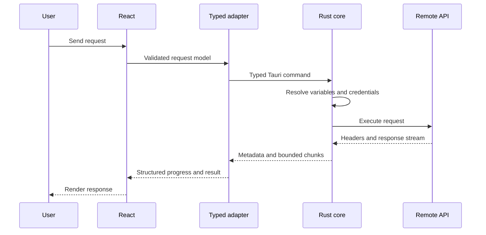

# GetRest architecture

## Status

This document describes the intended architecture for the first production version of GetRest. The project is still in its foundation phase, so implementation details may evolve through Architecture Decision Records (ADRs), while the boundaries and principles below should remain stable.

## Product goals

GetRest is a local-first, open-source desktop application for developing and testing APIs on Windows, macOS, and Linux.

The architecture prioritizes:

- predictable behavior across supported desktop platforms;
- privacy and safe handling of credentials;
- native network capabilities without browser CORS restrictions;
- responsiveness with large requests and responses;
- a clear boundary between unprivileged UI code and privileged system operations;
- a codebase that is approachable to both human and AI contributors;
- reusable domain logic that can support a future command-line client.

## Non-goals for the first version

The initial architecture does not attempt to provide:

- cloud accounts or mandatory synchronization;
- remote telemetry or analytics;
- an unrestricted plugin or script execution environment;
- a web-hosted version of the complete desktop application;
- separate implementations for each operating system;
- premature services or packages without a concrete consumer.

## System context



The WebView is a presentation surface. It is not the primary network engine and does not receive unrestricted operating-system access.

## Repository structure

```text
apps/
  desktop/       Tauri 2 desktop shell and React application
crates/
  api-engine/    HTTP, GraphQL, WebSocket, SSE, and gRPC execution
  storage/       SQLite persistence, migrations, import, and export
  secrets/       Cross-platform credential-store integration
  models/        Shared domain models and typed contracts
packages/
  ui/            Reusable React user-interface components
  formats/       OpenAPI, cURL, Postman, and Insomnia formats
docs/
  architecture.md
  decisions/     Architecture Decision Records
scripts/
  setup/         Native development-environment setup
```

Directories may be consolidated while they contain only trivial code. A new package or crate should have a real consumer and a clear ownership boundary.

## Architectural layers

### React presentation layer

React components render state, collect user intent, and provide accessible desktop interactions. Components must not invoke Tauri commands directly.

UI-specific concerns include:

- request and response editors;
- workspace navigation;
- history, search, and filtering;
- themes, layouts, and keyboard navigation;
- progress, cancellation, and error presentation.

Reusable components belong in `packages/ui` only when they are consumed by more than one feature or have a stable shared contract.

### TypeScript application services

Application services coordinate UI use cases and call a single typed Tauri adapter. They translate domain results into presentation state without duplicating Rust business rules.

Every TypeScript-to-Rust call must have:

- an explicit input and output contract;
- validation at the trust boundary;
- a structured error type;
- cancellation behavior where the operation can be long-running;
- tests for serialization and contract compatibility.

### Tauri boundary

The Tauri adapter is the only normal entry point from the WebView into privileged functionality. Capabilities and permissions must be minimal and scoped to the windows that require them.

The boundary must not expose:

- arbitrary shell execution;
- unrestricted file-system paths;
- raw credential-store access;
- generic commands that bypass domain validation.

### Rust application core

The Rust core owns privileged and performance-sensitive behavior:

- request execution and cancellation;
- TLS, certificates, authentication, and proxy configuration;
- persistence and migrations;
- import and export;
- secret storage and retrieval;
- local file access through narrow domain operations;
- redaction of sensitive information before logging or returning errors.

The core should be separated from Tauri-specific command handlers so that domain behavior remains independently testable and reusable by a future CLI.

## Request lifecycle



The Rust core executes REST, GraphQL, WebSocket, SSE, and gRPC traffic. This avoids browser CORS constraints and enables consistent support for proxies, custom certificates, client certificates, and protocol-specific behavior.

## Large payloads and streaming

Large bodies must not be repeatedly copied through WebView IPC. Implementations should use one or more of the following:

- bounded chunks with backpressure;
- temporary files managed by the Rust core;
- incremental parsing and rendering;
- explicit in-memory size limits;
- previews with opt-in loading of complete content.

Every long-running operation must be cancellable and clean up temporary resources after completion, cancellation, or application restart.

## Persistence

SQLite is the primary local store for workspaces, collections, environments, request metadata, and history. Schema changes use ordered migrations that can be tested from every previously supported schema version.

Credentials and secret environment values must not be stored as plaintext SQLite fields. The database stores stable references to values held in the operating-system credential store:

- Windows Credential Manager;
- macOS Keychain;
- Secret Service-compatible storage on Linux.

Exports exclude secrets by default. Any explicit secret export must clearly warn the user and require a deliberate action.

## Import and export

`packages/formats` owns parsing and generation for external formats such as OpenAPI, cURL, Postman, and Insomnia. Importers treat all input as untrusted and produce a validated intermediate model before persistence.

Format conversion must preserve source information when possible and report unsupported or lossy fields instead of silently discarding them.

## Security and privacy

GetRest is local-first and collects no telemetry by default. Network activity occurs only as a result of an explicit product feature, such as executing a request or checking for updates when that behavior is enabled and documented.

Security requirements include:

- redact authorization headers, cookies, tokens, API keys, and passwords from logs;
- apply least-privilege Tauri capabilities;
- validate all IPC, file, import, and network inputs;
- use the operating-system credential store for secrets;
- never commit certificates, credentials, request dumps, or local databases;
- introduce plugins or user scripts only after documenting a threat model and sandbox strategy.

## Cross-platform strategy

The same codebase should serve Windows, macOS, and Linux. Platform-specific code is isolated behind small interfaces and tested on the actual target operating system.

Native development and release builds are produced on their target platform:

- Windows: MSVC Build Tools and WebView2;
- macOS: Xcode Command Line Tools and the system WebKit stack;
- Ubuntu: WebKitGTK and the native Linux development libraries required by Tauri.

WSL and containers may support auxiliary services and tests, but they do not replace native desktop builds.

## Quality gates

Pull requests should eventually run the following checks on Windows, macOS, and Ubuntu:

- deterministic dependency installation;
- formatting and linting;
- TypeScript type checking;
- TypeScript and Rust unit tests;
- Rust `clippy` checks;
- desktop application build;
- focused integration tests for affected protocols or platform integrations.

Behavior changes require tests. Bug fixes should include regression coverage whenever practical.

## Evolution rules

Create or update an ADR when a change:

- replaces a core framework or persistence technology;
- changes a security or trust boundary;
- introduces a service, plugin runtime, or cloud dependency;
- changes supported platforms or build strategy;
- changes the license or data-handling model;
- invalidates an accepted decision listed below.

## Related decisions

- [ADR-0001: Tauri, React, TypeScript, and Rust](decisions/0001-tauri-react-typescript-rust.md)
- [ADR-0002: Execute API traffic in the Rust core](decisions/0002-rust-network-engine.md)
- [ADR-0003: Local-first SQLite and OS credential stores](decisions/0003-local-first-storage-and-secrets.md)
- [ADR-0004: Native builds on Windows, macOS, and Ubuntu](decisions/0004-native-cross-platform-builds.md)
- [ADR-0005: GNU GPL version 3 or later](decisions/0005-gpl-3-or-later.md)
